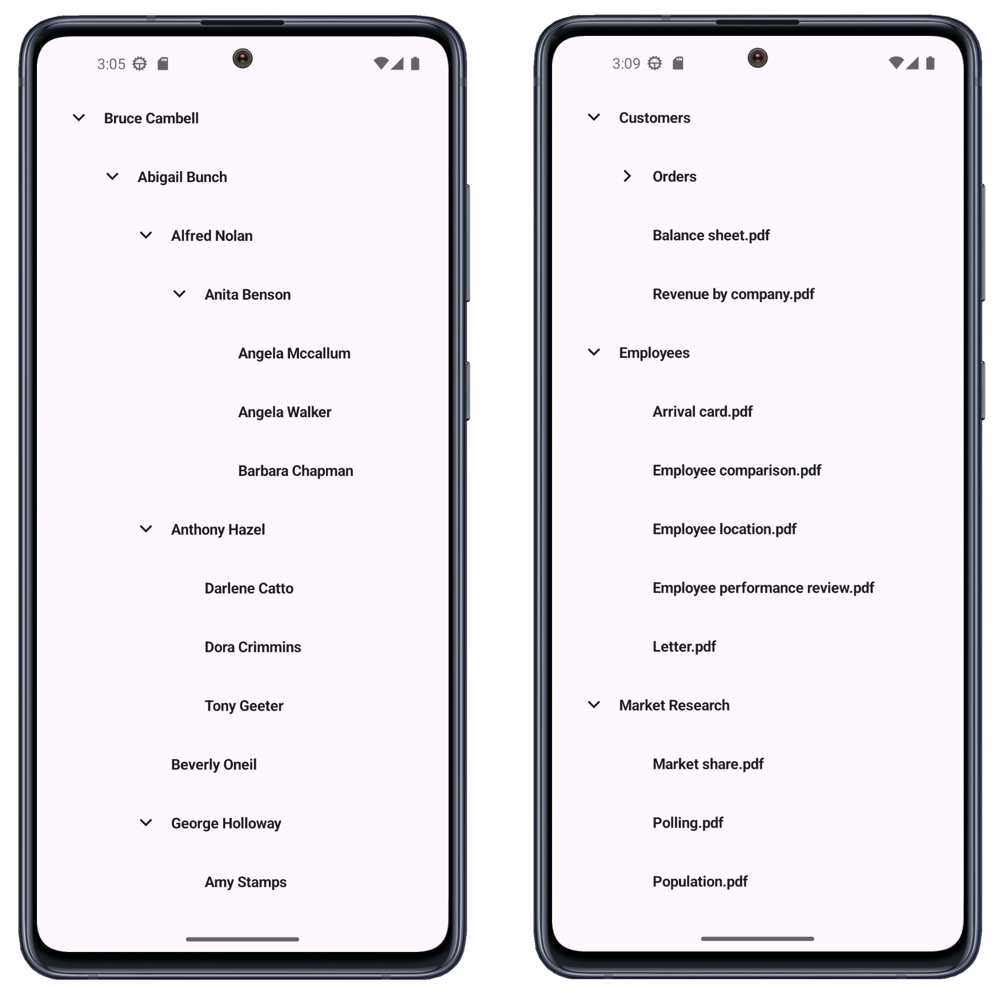

<!-- default badges list -->

<!-- default badges end -->

# DevExpress Tree View for .NET MAUI

The [DXTreeView](https://docs.devexpress.com/MAUI/DevExpress.Maui.TreeView.DXTreeView) control is part of [DevExpress Mobile UI for .NET MAUI](https://www.devexpress.com/maui/) - a development library that allows you to use a .NET cross-platform UI toolkit and C# to create native apps for iOS and Android.

For a limited time, **DevExpress Mobile UI for .NET MAUI** is available free of charge. To learn more about our offer and obtain your copy, visit the following page: [Free Offer - DevExpress Mobile UI for .NET MAUI](https://www.devexpress.com/xamarin-free).

## Requirements

Register your DevExpress NuGet Feed in Visual Studio to restore packages used in this solution. Review the following article for additional information: [Get Started with DevExpress Mobile UI for .NET MAUI](https://docs.devexpress.com/MAUI/403249/get-started). 

You can also refer to the following YouTube video for more information on how to get started with DevExpress .NET MAUI Controls: [Setting up a .NET MAUI Project](https://www.youtube.com/watch?v=juJvl5UicIQ).

## What's in This Repository

This repository contains projects that populate the DevExpress .NET MAUI Tree View control with [self-referential (flat)](https://docs.devexpress.com/MAUI/404899/tree-view/display-hierarchical-data#self-referential-data-structure) and [hierarchical](https://docs.devexpress.com/MAUI/404899/tree-view/display-hierarchical-data#hierarchical-data-structure) data.

* [Bind Tree View to Self-Referencial Data](/CS/TreeViewWithSelfReferenceData/)
* [Bind Tree View to Hierarchical](/CS/TreeViewWithHierarchicalData/)

## Documentation

- [Tree View](https://docs.devexpress.com/MAUI/404896/tree-view)

## More Examples

* [Stocks App](https://github.com/DevExpress-Examples/maui-stocks-mini)
* [Data Form](https://github.com/DevExpress-Examples/maui-data-form-get-started)
* [Data Editors](https://github.com/DevExpress-Examples/maui-editors-get-started)
* [Data Grid](https://github.com/DevExpress-Examples/maui-data-grid)
* [Collection View](https://github.com/DevExpress-Examples/maui-collection-view)
* [Charts](https://github.com/DevExpress-Examples/maui-charts)
* [Scheduler](https://github.com/DevExpress-Examples/maui-scheduler-get-started)
* [Tab Page](https://github.com/DevExpress-Examples/maui-tab-page-get-started)
* [Tab View](https://github.com/DevExpress-Examples/maui-tab-view-get-started)
* [Drawer Page](https://github.com/DevExpress-Examples/maui-drawer-page-get-started)
* [Drawer View](https://github.com/DevExpress-Examples/maui-drawer-view-get-started)
* [Collection View](https://github.com/DevExpress-Examples/maui-collection-view-get-started)
* [Popup](https://github.com/DevExpress-Examples/maui-popup-get-started)
